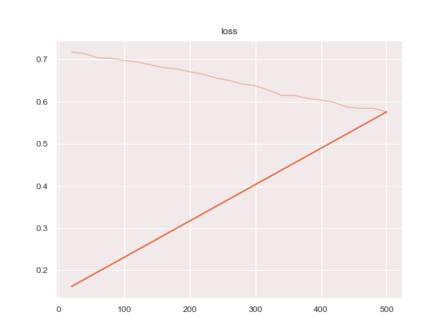
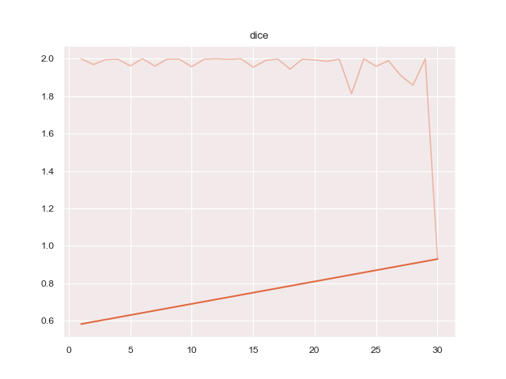
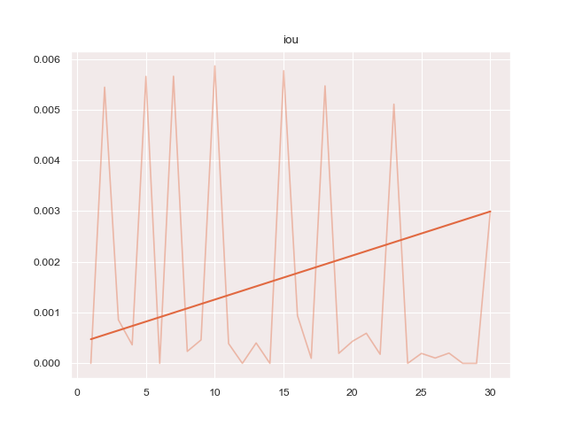
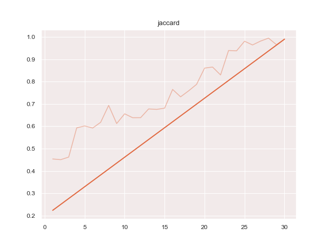
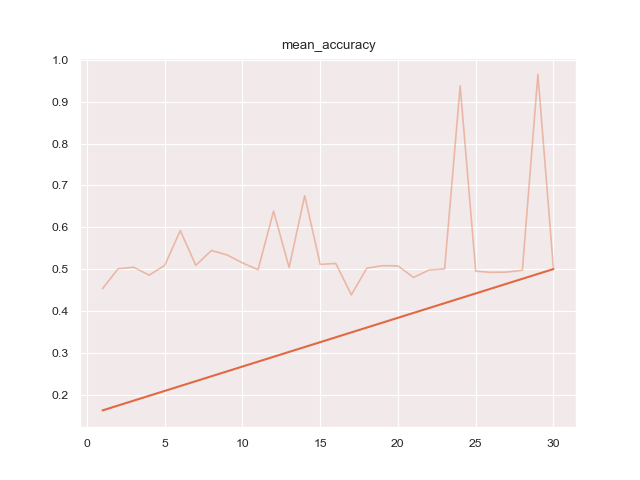
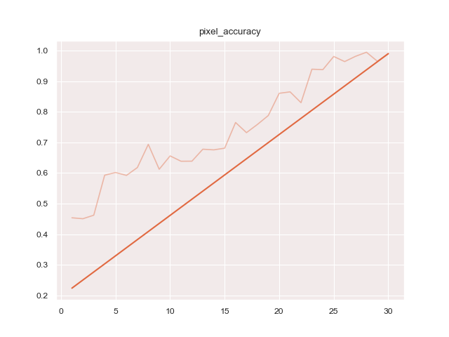

# protoseg

Prototyped Segmentation

## Install

The following package must be installed

* pip install git+https://github.com/chriamue/pytorch-semseg

then protoseg can be installed

```bash
pip install git+https://github.com/chriamue/protoseg
```

## Workflow


## Data

Images should be copied to ./data folder.
Images for training to train folder, the masks to train_masks folder.
Images for validation to val folder, the masks to val_masks folder.
Images for testing into test folder.

## Config

Every run is stored in a config file like:
[config](configs/gluoncv.yml)

## Backends

There should exist multiple backends.

* gluoncv
* pytorch-semseg

```yml
gluoncv:
  backend: gluoncv_backend
  backbone: resnet50
```

```yml
ptsemseg_unet:
  backend: ptsemseg_backend
  backbone: unet
  classes: 2
  width: 572
  height: 572
  mask_width: 388
  mask_height: 388
  orig_width: 768
  orig_height: 768
  gray_img: True
```

```yml
ptsemseg_segnet:
  backend: ptsemseg_backend
  backbone: segnet
  classes: 2
  width: 512
  height: 512
```

## Augmentation

There are several options for augmentation.
You can find a full list of augmentators in the docs of
[imgaug](https://imgaug.readthedocs.io/en/latest/source/augmenters.html#).
Each augmentator will be executed with probability 0.5 .

### Shape

Shape augmentation will be executed on image and mask.

```yml
  shape_augmentation:
    - Affine:
        rotate: -15
    - Affine:
        rotate: 30
    - Affine:
        scale: [0.8, 2.5]
    - Fliplr:
        p: 1.0
```

### Image

Image augmentation will be executed only on the image.

```yml
  img_augmentation:
    - GaussianBlur:
        sigma: [0, 0.5]
    - AdditiveGaussianNoise:
        scale: 50
```

## Filters

Filters are functions to preprocess images.
The functions have to consume an image first and then some parameters
and have to return the processed image.
Parameters can be given as list or
as dictionary.

```yml
  filters:
    - 'cv2.Canny': [100,200]
    - 'protoseg.filters.morphological.erosion':
        kernelw: 5
        kernelh: 5
        iterations: 1
```

## Metrices

There are some metrices available to measure on validation data.

```yml
  metrices:
    - 'pixel_accuracy': 'protoseg.metrices.accuracy.pixel_accuracy'
    - 'mean_accuracy': 'protoseg.metrices.accuracy.mean_accuracy'
    - 'dice': 'protoseg.metrices.dice.dice'
    - 'jaccard': 'protoseg.metrices.jaccard.jaccard'
    - 'iou': 'protoseg.metrices.iou.iou'
```

## Report

A report as PDF file of the results can be created.

Running

```bash
python3 train.py configs/ptsemseg_segnet.yml
```

produces following images and [pdf report](results/ptsemseg_segnet.yml.pdf) file after training.








## Hyperparameteropt

Hyperparameter trains multiple times with multiple configurations and tries to find

hyperparameters which produce the best loss.

Learnrate will be variated by default, but every other parameter in the config file can

be variated too.

An example configuration looks like:

```yml
ptsemseg_segnet:
  flit: False
  filters:
    - 'cv2.Canny': [100,200]
  hyperparamopt:
    - flip: [True, False]
    - filters: [['protoseg.filters.canny.addcanny': [100,200]],['protoseg.filters.morphological.opening': [5,5,1]]]
```

## Kaggle Competition Data

In folder ./scripts is ultrasound-nerve-segmentation.py which should be run as

```bash
python3 ./scripts/ultrasound-nerve-segmentation.py /path/to/competition-data data/
```

The script extracts competition images and copies them to the data folder.

## Usefull links

[A 2017 Guide to Semantic Segmentation with Deep Learning](http://blog.qure.ai/notes/semantic-segmentation-deep-learning-review)
[Satellite Image Segmentation: a Workflow with U-Net](https://medium.com/vooban-ai/satellite-image-segmentation-a-workflow-with-u-net-7ff992b2a56e)